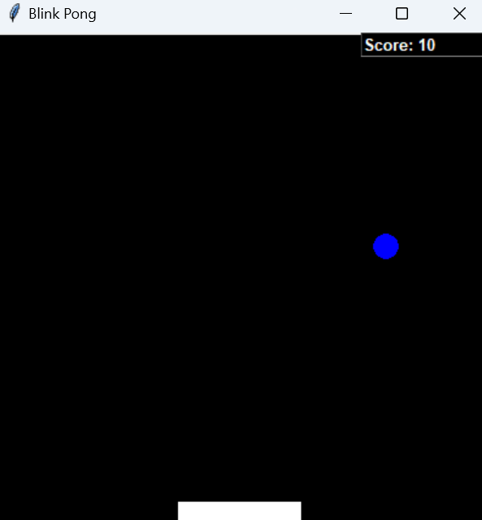
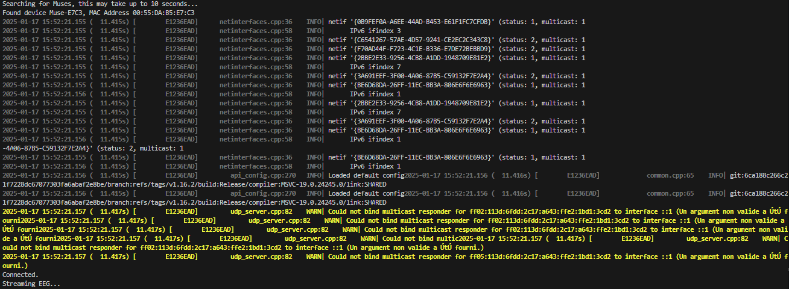
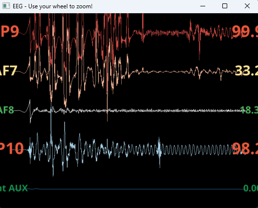

# Blink Pong - Jeu Pong contrôlé par les clignements des yeux

**Blink Pong** est un jeu classique de Pong contrôlé par les clignements des yeux et les serrements de mâchoire, en utilisant un casque EEG Muse 2. Ce projet combine la lecture des données EEG via LSL (Lab Streaming Layer) avec une interface graphique simple pour créer une expérience de jeu immersive.



## Présentation du projet

Blink Pong est un jeu de Pong où la raquette est contrôlée par les clignements des yeux et les serrements de mâchoire détectés par un casque EEG Muse 2. Le projet utilise :
- **Python** pour la logique du jeu et la lecture des données EEG.
- **Tkinter** pour l'interface graphique.
- **pylsl** pour se connecter au stream EEG via LSL.
- **muselsl** pour streamer les données du casque Muse.

---

## Fonctionnalités

- **Contrôle par clignements des yeux** : Les clignements des yeux déplacent la raquette vers la gauche ou la droite.
- **Détection des serrements de mâchoire** : Les serrements de mâchoire sont détectés et affichés à l'écran (non utilisés pour le contrôle dans cette version).
- **Interface graphique simple** : Une interface minimaliste avec un fond noir, une raquette blanche, une balle bleue et un score en temps réel.
- **Lecture des données EEG en temps réel** : Les données EEG sont lues via LSL et utilisées pour détecter les événements.

---

## Prérequis

Avant de pouvoir exécuter ce projet, assurez-vous d'avoir les éléments suivants :

1. **Casque EEG Muse 2** : Le casque doit être connecté et configuré pour streamer des données via LSL.
2. **Python 3.7 ou supérieur** : Le projet est écrit en Python.
3. **Bibliothèques Python** :
   - `tkinter` (inclus avec Python)
   - `pylsl`
   - `muselsl`
   - `subprocess` (inclus avec Python)
   - `threading` (inclus avec Python)
   - `time` (inclus avec Python)
   - `random` (inclus avec Python)

---

## Installation

1. **Cloner le dépôt** :
   ```bash
   git clone https://github.com/Infinityy1001/Pong_EEG.git
   cd main/Blinking_PONG_no_ML
   ```

2. **Créer un environnement virtuel (optionnel mais recommandé)** :
   ```bash
   python -m venv env
   source env/bin/activate  # Sur Windows : env\Scripts\activate
   ```

3. **Installer les dépendances** :
   ```bash
   pip install pylsl muselsl
   ```

4. **Configurer le casque Muse** :
   - Assurez-vous que votre casque Muse 2 est allumé et connecté à votre appareil.
   - Installez l'application Muse Monitor ou utilisez `muselsl` pour vérifier que le casque stream des données.

Quelques commandes pour prendre en main le casque : 
- Lancer le stream :

```bash
   muselsl stream
```


- Lancer la visualisation : 

```bash
   muselsl view --version 2
```



---

## Utilisation

1. **Lancer le jeu** :
   ```bash
   python blink_pong_eeg.py
   ```

2. **Contrôles** :
   - **Clignements des yeux** : Les clignements des yeux déplacent la raquette.
   - **Touches fléchées** : Vous pouvez également utiliser les touches fléchées gauche et droite pour déplacer la raquette.

3. **Fermer le jeu** :
   - Appuyez sur `Ctrl+C` dans le terminal pour arrêter le jeu.

---

## Personnalisation

Vous pouvez personnaliser plusieurs aspects du jeu en modifiant les variables globales dans le code :

- **Taille de la fenêtre** : Modifiez `root.minsize(400, 400)` et `c = Canvas(width=400, height=400)`.
- **Couleurs** :
  - Fond : `background='#000000'`
  - Raquette : `fill='white', outline='white'`
  - Balle : `fill='blue', outline='blue'`
  - Score : `fg='white', bg='black'`
- **Vitesse** :
  - Raquette : `paddle_speed = 5`
  - Balle : `ball_speed = 5`

---

## Contribuer

Les contributions sont les bienvenues ! Voici comment vous pouvez contribuer :

1. **Signaler un problème** : Ouvrez une [issue](https://github.com/Infinityy1001/Pong_EEG/issues) pour signaler un bug ou suggérer une amélioration.
2. **Proposer une fonctionnalité** : Ouvrez une [issue](https://github.com/Infinityy1001/Pong_EEG/issues) pour discuter de nouvelles idées.
3. **Soumettre une pull request** :
   - Forkez le dépôt.
   - Créez une branche pour votre fonctionnalité (`git checkout -b nouvelle-fonctionnalité`).
   - Committez vos changements (`git commit -m 'Ajouter une nouvelle fonctionnalité'`).
   - Poussez la branche (`git push origin nouvelle-fonctionnalité`).
   - Ouvrez une pull request.

